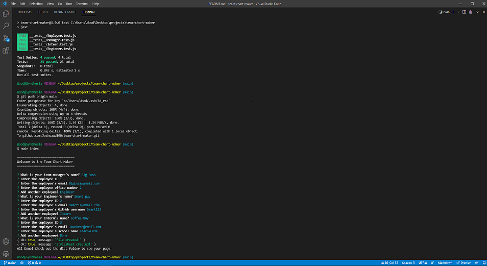

# Team Chart Maker

## Description

This project takes user input for a team of employees and generates an html page containing a chart of those employees that contains their information.

## Table of Contents

- [Installation](#installation)
- [Usage](#usage)
- [License](#license)
- [Questions](#questions)

## Installation

Download or clone the repository and then run npm install

## Usage

After installation, run node index in the CLI and follow the prompts. Once you have entered the information, an html file will be generated for you in the /dist folder of the projects directory.

## License

MIT License

     Copyright (c) [2021]

     Permission is hereby granted, free of charge, to any person obtaining a copy
     of this software and associated documentation files (the "Software"), to deal
     in the Software without restriction, including without limitation the rights
     to use, copy, modify, merge, publish, distribute, sublicense, and/or sell
     copies of the Software, and to permit persons to whom the Software is
     furnished to do so, subject to the following conditions:

     The above copyright notice and this permission notice shall be included in all
     copies or substantial portions of the Software.

     THE SOFTWARE IS PROVIDED "AS IS", WITHOUT WARRANTY OF ANY KIND, EXPRESS OR
     IMPLIED, INCLUDING BUT NOT LIMITED TO THE WARRANTIES OF MERCHANTABILITY,
     FITNESS FOR A PARTICULAR PURPOSE AND NONINFRINGEMENT. IN NO EVENT SHALL THE
     AUTHORS OR COPYRIGHT HOLDERS BE LIABLE FOR ANY CLAIM, DAMAGES OR OTHER
     LIABILITY, WHETHER IN AN ACTION OF CONTRACT, TORT OR OTHERWISE, ARISING FROM,
     OUT OF OR IN CONNECTION WITH THE SOFTWARE OR THE USE OR OTHER DEALINGS IN THE
     SOFTWARE.

## Badges

## Questions

You can reach me here with any questions:
https://github.com/Joshuawd190
joshuawd190@gmail.com
